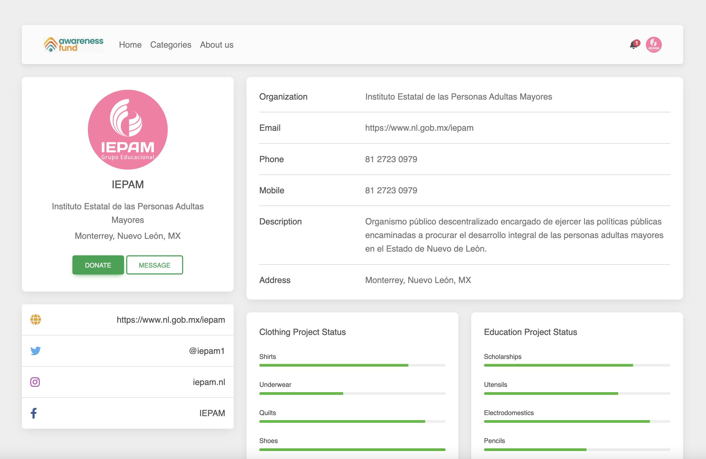

# awareness fund
[](https://opensource.org/licenses/MIT)

## Description

This project is a web-page designed with the purpose of connecting users and associations in order to donate clothes, furniture, food, books, lenins, toys and others. When you Sign-up you get the chance to edit profile, add new goals for the association and add a location for users to know where to drop their donations. 

GitHub Repo: https://github.com/leogzz0/awareness-fund




## Table of Contents 

- [Installation](#installation)

- [Technologies Used](#technologies)

- [Usage](#usage)

- [License](#license)

- [Contributing](#contributing)

- [Test](#test)

- [Questions](#questions)


## Installation

To install necessary dependencies, follow the next steps and run these commands:

```bash
npm i moongose
```

## Technologies 
- HTML
- CSS
- JavaScript
- Node.js 
- Express.js
- MongoDB
- Insomnia
- Bootstrap

## Usage

This app can be used by any association who wants to have a bigger reach, faster their goals and have abetter interaction with their doners. For users this app can be used to find an association near you that better fit your need for what you want to donate.

## License

This project is licensed under the MIT license

## Contributing

Contributors:
- leogzz0
- pabloramm
- samuelacosta
- nico

## Test
To test this app:

```bash
node app.js
```

## Questions

If you have any questions about the repository, open an issue or contact any of us contributors in https://github.com/leogzz0/awareness-fund
